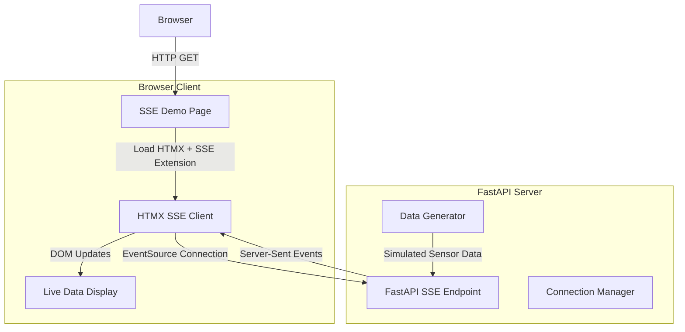

# Design Document: HTMX SSE Demo

## Overview

This design implements a demonstration page showcasing HTMX's Server-Sent Events (SSE) extension for real-time data streaming. The demo provides an alternative to WebSocket-based streaming using the standard SSE protocol, demonstrating how HTMX can handle server-pushed updates with minimal JavaScript.

The implementation will extend the existing FastAPI application with a new SSE endpoint and corresponding HTML template that uses the HTMX SSE extension to display real-time sensor data updates.

## Architecture

The system follows a client-server architecture with unidirectional data flow from server to client:



### Key Differences from WebSocket Approach

- **Unidirectional**: SSE only supports server-to-client communication
- **HTTP-based**: Uses standard HTTP connections with `text/event-stream` content type
- **Automatic Reconnection**: Browsers automatically reconnect on connection loss
- **Simpler Protocol**: No custom message framing required

## Components and Interfaces

### 1. SSE Demo Page Template (`templates/htmx_sse_demo.html`)

**Purpose**: HTML template that demonstrates HTMX SSE functionality

**Key Elements**:
- HTMX core library and SSE extension loading
- Connection control buttons (Start/Stop)
- Live data display area
- Connection status indicators
- Navigation links to other demos

**HTMX SSE Attributes**:
- `hx-ext="sse"`: Enables SSE extension for the element
- `sse-connect="/sse-stream"`: Establishes EventSource connection to endpoint
- `sse-swap="message"`: Swaps incoming SSE messages into element content

### 2. SSE Endpoint (`/sse-stream`)

**Purpose**: FastAPI endpoint that streams sensor data via Server-Sent Events

**Interface**:
```python
@app.get("/sse-stream")
async def sse_stream() -> StreamingResponse
```

**Responsibilities**:
- Establish persistent HTTP connection with `text/event-stream` content type
- Generate simulated sensor data at regular intervals
- Format data according to SSE specification
- Handle client disconnections gracefully
- Include appropriate CORS headers

**SSE Message Format**:
```
event: message
data: <div class="data-item">Sensor reading: 23.5°C</div>

```

### 3. SSE Connection Manager

**Purpose**: Manages active SSE connections and data streaming

**Interface**:
```python
class SSEConnectionManager:
    async def add_connection(self, response: StreamingResponse)
    async def remove_connection(self, response: StreamingResponse)
    async def generate_data_stream(self) -> AsyncGenerator[str, None]
```

**Responsibilities**:
- Track active SSE connections
- Generate simulated sensor data
- Format data for SSE transmission
- Clean up resources on disconnection

### 4. Data Generator

**Purpose**: Generates simulated sensor data for streaming

**Interface**:
```python
def generate_sensor_data() -> Dict[str, Any]:
    return {
        "temperature": float,
        "humidity": float,
        "pressure": float,
        "timestamp": str
    }
```

## Data Models

### Sensor Data Model
```python
from pydantic import BaseModel
from datetime import datetime

class SensorReading(BaseModel):
    temperature: float  # Celsius
    humidity: float     # Percentage
    pressure: float     # hPa
    timestamp: datetime
    
    def to_html(self) -> str:
        """Convert to HTML for SSE transmission"""
        return f"""
        <div class="data-item animate-in slide-in-from-bottom-2 duration-300 mb-2 p-3 bg-white rounded-lg border border-gray-200">
            <div class="flex items-center justify-between">
                <div class="flex items-center space-x-4">
                    <div class="w-2 h-2 bg-blue-500 rounded-full"></div>
                    <div class="text-sm">
                        <span class="font-medium text-gray-900">SSE Data</span>
                        <span class="text-gray-500 ml-2">{self.timestamp.strftime('%H:%M:%S')}</span>
                    </div>
                </div>
                <div class="flex items-center space-x-4 text-sm">
                    <span class="text-blue-600">🌡️ {self.temperature}°C</span>
                    <span class="text-green-600">💧 {self.humidity}%</span>
                    <span class="text-purple-600">📊 {self.pressure} hPa</span>
                </div>
            </div>
        </div>
        """
```

## Correctness Properties

*A property is a characteristic or behavior that should hold true across all valid executions of a system-essentially, a formal statement about what the system should do. Properties serve as the bridge between human-readable specifications and machine-verifiable correctness guarantees.*

Let me analyze the acceptance criteria for testability:

### Converting EARS to Properties

Based on the prework analysis, here are the consolidated correctness properties:

**Property 1: SSE Connection Management**
*For any* SSE endpoint connection request, the system should establish a persistent EventSource connection that remains open until explicitly closed or an error occurs
**Validates: Requirements 2.1, 4.1**

**Property 2: Event Streaming and Format Compliance**
*For any* active SSE connection, the endpoint should send properly formatted events at regular intervals with correct SSE specification format (event type and data fields)
**Validates: Requirements 2.2, 2.4**

**Property 3: DOM Updates from SSE Events**
*For any* SSE event received by the HTMX extension, the DOM should be updated with the event data without requiring a page refresh
**Validates: Requirements 3.1, 4.2**

**Property 4: Data Feed Management**
*For any* sequence of incoming data events, the live feed should append new items with timestamps and limit the total number of displayed items to prevent performance issues
**Validates: Requirements 3.2, 3.3**

**Property 5: Resource Cleanup**
*For any* SSE connection that is terminated (either by client disconnect or server shutdown), all associated resources should be properly cleaned up
**Validates: Requirements 2.3**

**Property 6: Error Handling and Recovery**
*For any* connection error or failure condition, the system should display appropriate error messages and handle the error gracefully without crashing
**Validates: Requirements 3.5, 4.4**

**Property 7: Event Routing**
*For any* SSE event with a specific event type, the HTMX extension should route the event to the correct target element based on the sse-swap configuration
**Validates: Requirements 4.3**

**Property 8: CORS Header Inclusion**
*For any* SSE endpoint response, appropriate CORS headers should be included to support cross-origin requests
**Validates: Requirements 2.5**

**Property 9: Interactive Control Responsiveness**
*For any* user interaction with start/stop controls, the system should provide immediate visual feedback and update connection state accordingly
**Validates: Requirements 5.3**

**Property 10: Responsive Layout Behavior**
*For any* viewport size change, the SSE demo page should maintain proper layout and functionality across desktop and mobile devices
**Validates: Requirements 5.5**

## Error Handling

### Connection Errors
- **Network Failures**: Automatic reconnection with exponential backoff
- **Server Errors**: Display error messages and provide manual reconnection option
- **Invalid Data**: Log errors and continue processing valid events

### Client-Side Errors
- **HTMX Extension Loading**: Fallback to manual refresh if extension fails to load
- **DOM Manipulation**: Graceful degradation if target elements are missing
- **Memory Management**: Automatic cleanup of old data items to prevent memory leaks

### Server-Side Errors
- **Connection Limits**: Implement connection pooling and limits
- **Resource Exhaustion**: Monitor and clean up inactive connections
- **Data Generation**: Handle errors in sensor data simulation gracefully

## Testing Strategy

### Dual Testing Approach

This implementation will use both unit tests and property-based tests for comprehensive coverage:

**Unit Tests** will verify:
- Specific examples of SSE message formatting
- Individual UI component behavior
- Error conditions and edge cases
- Integration between FastAPI and HTMX components

**Property-Based Tests** will verify:
- Universal properties across all inputs using Hypothesis (Python) for backend testing
- Frontend properties using fast-check (JavaScript) for HTMX behavior
- Each property test will run minimum 100 iterations
- Tests will be tagged with format: **Feature: htmx-sse-demo, Property {number}: {property_text}**

### Property-Based Testing Configuration

**Backend Testing (Python/FastAPI)**:
- Use Hypothesis library for property-based testing
- Test SSE endpoint behavior across various connection scenarios
- Validate data generation and formatting properties
- Test resource cleanup and error handling

**Frontend Testing (JavaScript/HTMX)**:
- Use fast-check library for property-based testing of HTMX behavior
- Test DOM manipulation and event handling properties
- Validate responsive design across viewport sizes
- Test user interaction responsiveness

**Integration Testing**:
- End-to-end tests using Playwright or similar
- Test complete SSE flow from connection to DOM updates
- Validate cross-browser compatibility
- Test network failure scenarios and recovery

### Test Coverage Requirements

Each correctness property must be implemented by a single property-based test that:
1. References the specific design document property number
2. Validates the universal behavior described in the property
3. Runs sufficient iterations to catch edge cases
4. Provides clear failure messages when properties are violated

The testing strategy ensures both specific examples work correctly (unit tests) and universal properties hold across all inputs (property tests), providing comprehensive validation of the SSE demo functionality.